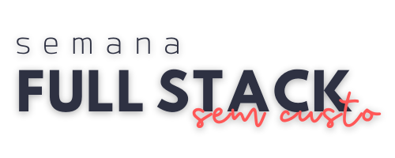

# Semana Full Stack Sem Custo, da Codar.me!




**Para rodar o projeto:**

```bash
npm run dev
# or
yarn dev
```

Abra [http://localhost:3000](http://localhost:3000) no seu navegador e veja o resultado!

## Material de apoio

- [Figma (layout do projeto)](https://www.figma.com/file/OlPhiP13rGlapw5OOuQDOV/Clocker?node-id=0%3A1)